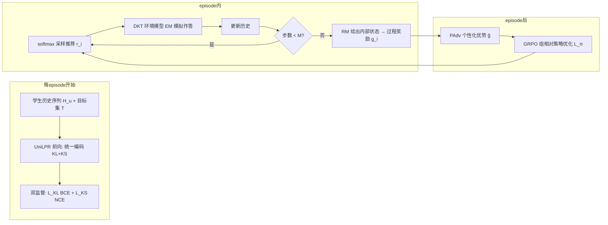

# UNO 算法介绍

来源：UNO_AAAI2026.pdf（AAAI-26）。UNO = **UN**ified **O**ffline Training Paradigm for Learning Path Recommendation。配套代码见仓库 `Agent/UNO.py`、`LifeLongKT/DKT.py`（UniLPR 类）、`Envs/Env_junyiDKT.py`。

## 1. 要解决的问题

**学习路径推荐（LPR）**：给定学生历史学习序列和目标知识点集合，推荐一条最优学习路径，最大化学生在目标上的提升。

现有 RL 方法的三个缺陷：
1. **稀疏奖励**：只用最终测试分数评价整条序列，无法评估每道题对目标的贡献——序列整体差但其中有用的题会被误判
2. **匿名会话**：按会话切分打散数据，丢失长期历史，无法识别学生个性化状态
3. **任务单一**：只设计"会话内学习"一种目标，没有覆盖复习、预习、探索等终身学习需求

UNO 的对应方案：**离线训练 + 稠密过程奖励**（奖励模型逐题评估）、**UniLPR 统一建模**（长期积累 × 知识结构）、**三种学习任务**（历史复习/近期学习/探索学习）。

## 2. 形式化

符号：学生序列 $H_u = \{(h_1,a_1),...,(h_n,a_n)\}$；目标题集 $T \subseteq Q$（$Q$ 为 $N$ 道题）；$a_i \in \{0,1\}$ 为作答正确性；推荐路径 $R_u = (r_1,...,r_k)$。

**学习路径有效性**（核心指标，论文 Eq 1-2）：

$$E_p(R_u) = \frac{E_{end}(R_u) - E_{start}}{E_{sup} - E_{start}}$$

- $E_{start}$：episode 开始时目标集得分；$E_{sup}$：满分；$E_{end}$：推荐后得分
- 目标是通过 KT 模型预测：$E_{end}(R_u) = \sum_{q_k \in T} \text{score}(KL_t, q_k)$，$KL_t = \text{KT}(H_u)$（Eq 3-4）
- 每步后更新历史：$H_u^i = H_u^{i-1} \cup \{(r_i, a_{n+i})\}$

**双模型架构（EM/RM）**：
- **环境模型 EM**：预训练 DKT，模拟学生作答 $a_{n+i}$ 与外部分数 $E_s, E_e(R_u)$；隐藏内部状态 $KL_t$（贴近真实部署：只能看到测试分数与交互反馈）
- **奖励模型 RM**：预训练 DKT，提供内部状态 $KL_t$，在离线训练阶段给出**稠密过程奖励**；测试时停用（模拟真实部署）

**过程奖励**（Eq 5）：第 $i$ 步的奖励 = 路径有效性的增量

$$g_i = E_p(R_u^i) - E_p(R_u^{i-1})$$

## 3. 整体架构

## 4. UniLPR 推荐模型

### 4.1 统一序列编码（Eq 8-10）

把"问题嵌入 $X_q \in \mathbb{R}^{N \times d}$"和"作答嵌入 $X_a \in \mathbb{R}^{3 \times d}$"（正确 0/1 + 提示动作 $a_{[REC]}$）交错拼接成统一序列：

$$H'_u = \{h_1, a_1, ..., h_n, a_n, r_1, a_{n+1}, ..., r_i, a_{n+i}\}$$

目标表示取均值嵌入 $x_T = \frac{1}{|T|}\sum_{t \in T} x_t$，以提示动作 $x_{[REC]}$ 追加到序列末尾：

$$X'_u = X_u \,||\, [x_T, x_{[REC]}]$$

加上位置嵌入 $X_p$（问题位置 + 作答位置）得到最终输入 $X = X'_u + X_p$。**关键设计**：$[REC]$ token 显式告诉模型"在这里生成推荐"，目标均值嵌入让模型感知要攻克的目标集。

### 4.2 联合推荐（Eq 11-15）

Transformer decoder（$L$ 层、因果掩码 $M$、GeLU 前馈）输出统一表示 $E$，其中 $e_{[REC]}$ 对应提示动作位置。推荐打分：

$$s(q) = \frac{\exp(e_{[REC]}^\top x_q / \tau)}{\sum_{q' \in Q} \exp(e_{[REC]}^\top x_{q'} / \tau)}, \quad r_{i+1} \sim p(q)$$

即：对全题库计算相似度 softmax，**采样**下一道题（随机策略保证探索）。

## 5. 统一优化

### 5.1 双监督预热（Eq 16-17）

每 episode 开头，用历史序列做两个监督任务，建立稳健的统一表示：
- **L_KL（BCE）**：预测作答正确性 $\sigma(W_a e_{a_i} + b_a)$——建模知识水平 KL
- **L_KS（NCE）**：对比学习，正样本为下一题 $h_i$，负样本 $N_{neg}$ 个随机采样——建模知识结构 KS 的序列依赖

### 5.2 个性化优势 PAdv（Eq 7）

把每个学生的推荐序列视为一个个性化组，在**学生序列内**标准化过程奖励，缓解组间歧视、保留组内个性化：

$$\tilde{g}_i = \frac{g_i - \mu_u}{\sigma_u + \epsilon_0}$$

其中 $\mu_u, \sigma_u$ 是该学生序列内 $g$ 的均值与标准差。

### 5.3 GRPO 组相对策略优化（Eq 18-19）

episode 结束后，用 PAdv 作为优势做裁剪目标：

$$L_\pi = -\mathbb{E}\left[\min\left(\rho_k(\theta)\tilde{g}_k,\ \text{clip}(\rho_k(\theta), 1-\epsilon, 1+\epsilon)\,\tilde{g}_k\right)\right]$$

$$\rho_k(\theta) = \frac{\pi_\theta(r_{k+1}|H_k)}{\pi_{old}(r_{k+1}|H_k)}$$

与 PPO 的区别：优势不是 value 网络估计的 GAE，而是**奖励模型直接给出的过程奖励 + 组内标准化**——这正是"离线稠密奖励"范式的核心。

## 6. 三种学习任务

| 任务 | 论文名 | 目标构造 | 步数 |
|---|---|---|---|
| rct | Recent Learning（近期学习） | 保留序列前 60%，从后 20% 去重题中选目标 | 5/10/20 |
| his | Historical Review（历史复习） | 从已学过的题中随机选 10 道 | 10/20/30 |
| exp | Exploratory Learning（探索学习） | 从从未见过的题中随机选 10 道 | 10/20/30 |

## 7. 训练流程

1. **预训练 KT**：DKT（EM 与 RM 各一）在 80/10/10（代码）或 85/15（论文表述）学生划分上训练
2. **RL 训练**：5000 episode/run × 3 runs；每 episode 内：双监督预热 → 逐步采样推荐 → EM 模拟作答 → RM 给过程奖励
3. **测试**：1000 episode，停止更新参数，RM 停用，报告平均 $E_p$

## 8. 代码实现对照

| 论文组件 | 代码位置 | 说明 |
|---|---|---|
| UniLPR 编码器 | `LifeLongKT/DKT.py` `class UniLPR` | Transformer 双流编码（item/action 交错 + 位置嵌入） |
| $[REC]$ token + 目标拼接 | `UniLPR.forward` 中 `'goal' in batch` 分支 | goal 均值嵌入 + action=2 特殊位 |
| 双监督 L_KL / L_KS | `UNO.begin_episode` | kt_loss（BCE）+ seq_loss（related_loss NCE） |
| 过程奖励 $g_i$ | `Env_junyiDKT.step` 返回累计 Ep；`UNO.learn` 取逐差 | `advantages[1:] -= advantages[:-1]` 还原增量 |
| PAdv | `UNO.learn` | 逐差后 `(adv - mean)/(std + 1e-8)`（学生序列内） |
| GRPO 裁剪目标 | `UNO.learn` | `-min(ratio·adv, clip(ratio,1±ε)·adv)`，按 group_size 分块 |
| EM 模拟 | `Env_junyiDKT` | DKT `states=True` 输出内部状态判作答 |

## 9. 复现提示

代码存在多个与论文协议不一致之处（阈值语义、种子、EM/RM 双模型、UniLPR 预训练等），完整清单见同目录 `problem-list.md`。**方法层面**本文描述的就是论文与代码共同实现的核心；**数字层面**以"机制跑通、量级接近"为现实目标。
